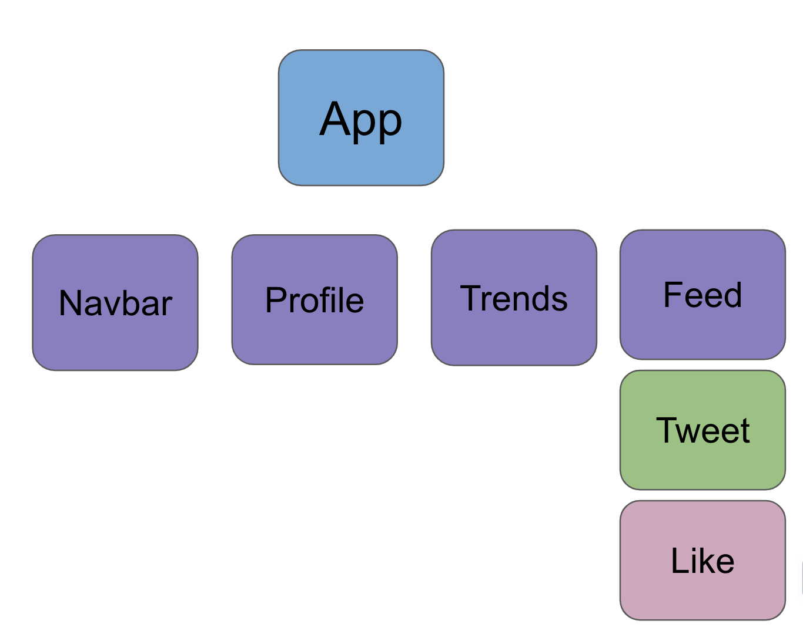

import { Head, Image } from 'mdx-deck'
export { default as theme } from './theme'
import { LiveCode } from 'mdx-deck-live-code';
import { Split } from 'mdx-deck/layouts'
import { Box } from 'grid-styled'
import { Appear } from 'mdx-deck'


---
# React 
---

# JSX

* Syntax extension for javascript
* Looks similar to a scripting language 
* Couples UI logic can be coupled with events and state

```javascript
const name = 'Aria Malkani';
const element = <h1>Hello, {name}</h1>;
```
* Embed javascipt expressions inside curly brackets

---

export default Split

# Bloooooop

# Snoot

---


Babel (javascipt compiler) compiles JSX down to a ```React.createElement()``` call

Both these examples compile to the same thing

export default Split

```javascript
const element = (
  <h1 className="greeting">
    Hello, world!
  </h1>
);
```

```javascript
const element = React.createElement(
  'h1',
  {className: 'greeting'},
  'Hello, world!'
);
```


---

# Components

* React breaks everything down into classes or Components
* Every component has a render method that returns JSX 


```javascript
import React, {Component} from "react";

class App extends Component {
    render() {
        return <h1> wow react </h1>
    }
}

export default App
```
---

Component get organized into tree structures 

Let's look at an example

---

export default Split





---
# React DOM


* You inject react application as the "root" node, which allows it to create a virtual DOM (Document Object Model)
* Using every component's render method, it displays the web page

```javascript
ReactDOM.render(
  App,
  document.getElementById('root')
);
```

* Every time the state changes, it calculates the minimal difference and rerenders only the necessary components
* Makes in BLAZING fast


---
